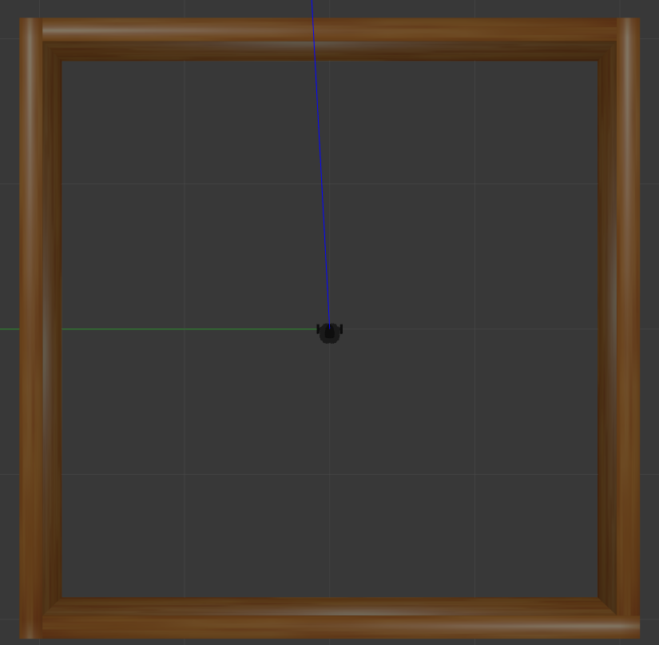
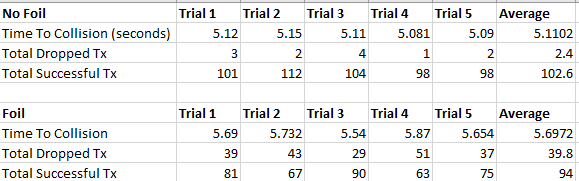

# ROS Acceleration Test
This demo was constructed to investigate the effect of interference within the communicaition channel on the overall acceleration of the turtlebot agent.
The demo used the same system setup as described here: [System Setup](../WirelessROScontrol/README.md)

## Simulation Enviornment
The agent was simulated in a constructed Gazebo world that can be seen in the image below.

The agent was sent a constant Twist message at a set interval via the aforementioned communcations setup in the presence of interference, and in the presence of no interference. 
The time it took for the agent to move from the center of the world to the point where it collided with the wall was measured. Additionally, the number of sucessful transmission and dropped transmissions were also recorded
in each interference case.

## Experimental Results
The results from the experiment described above can be seen in the image below.

It can be seen that the increase in the number of dropped data packets over a given window of time does seem to have a small effect on the overall acceleration time of the agent.

