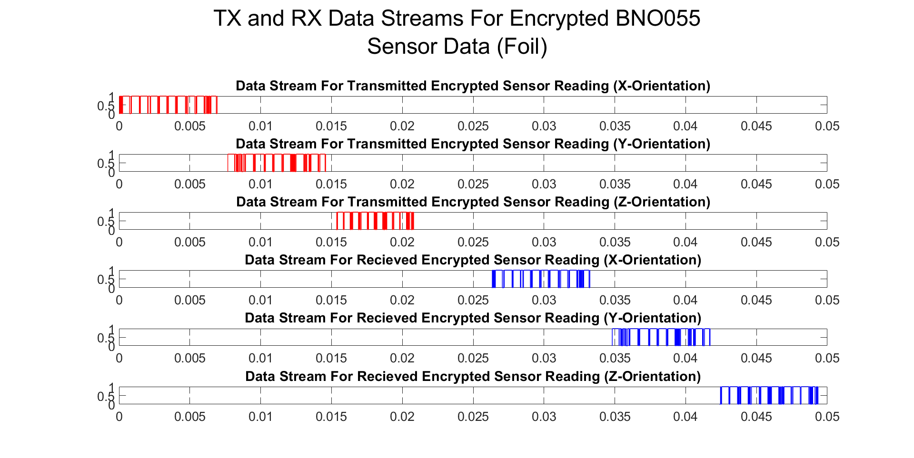

# Wireless Speed Transmission Test

This sub-directory contains the software used in a test constructed to measure the overall transmission time of a sensor reading taken from a BNO055 sensor that was sent to the RX side of the system, and then sent back to the TX side of the system.

# Hardware Setup

The overall hardware configuration of the system as used in this experiment can be seen in the image below.

# Experimental Procedure

The experimental procedure used here can be seen in the flowchart in the image below.

# Results

Using the obtained data from a interference present case and a no interference present case, two corresponding bitstream representations of the round trip data was constructed graphically in MATLAB. Each of the corresponding bitstreams can be seen in the images below.

