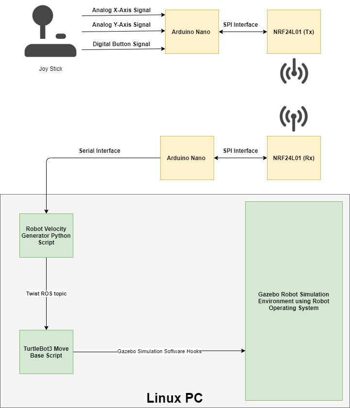
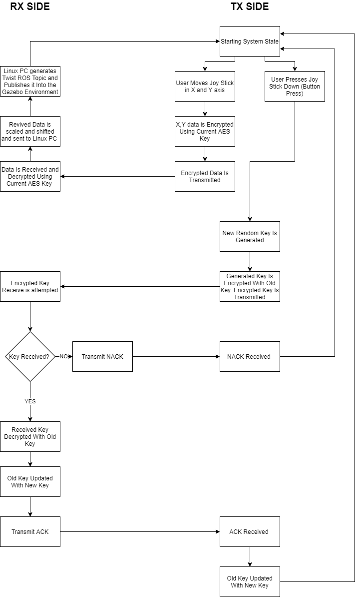

# AES Encrypted Wireless Control of TurtleBot3 in Gazebo
The two arduino sketches and ROS node seen in this directory allow for the control encrypted wireless control of a turtlebot3 agent in gazebo using user input obtained from a joystick.

## Functional System Setup
The function block diagram in the image below outlines the various components used in this demo, along with relavent interactions between them.

## Software Functionallity Flowchart
The functional flowchart diagram seen below depicts the overall software functionallity available in this demo.

