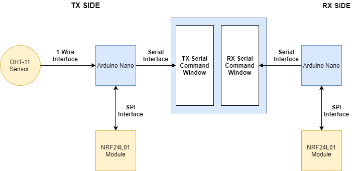

# Key Rotation Demo
These two arduino sketches contain the functionallity required to send encrypted data between arduino nanos using NRF24L01 transciever modules, in addition to performing AES key rotation.

## Demo Hardware Setup
The function block schematic seen in the image below depicts the hardware setup used in this demo.

## Key Rotation Functionallity
The flowchart seen in the image below depicts the software functionallity used to implement the AES key rotation process.

